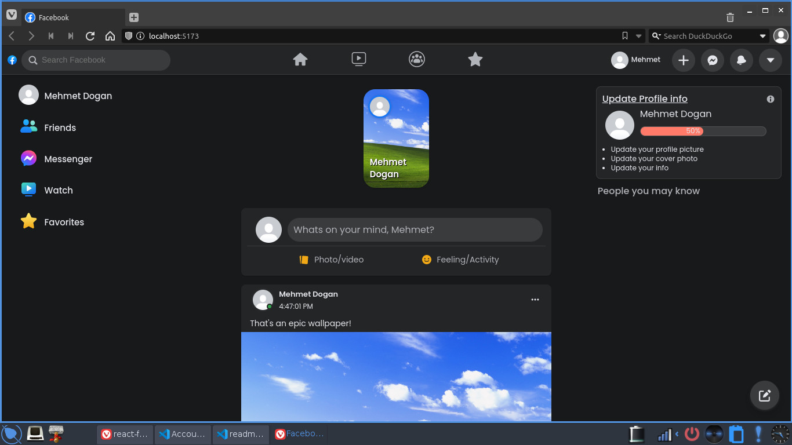

# 🚀 ReactFacebook 🚀

ReactFacebook is a project created using the popular JavaScript library React and Firebase. As the name suggests, it is a Facebook clone with similar features and functionalities.

## 📸 Screenshots

## 👨‍💻 Installation

To get started with ReactFacebook, you need to have Node.js and npm installed on your system. Here are the steps to run the project locally:

1. Clone the repository in your local machine.
2. Install the dependencies using `yarn install`.
3. Create a project on Firebase and create and configure your Firebase keys in a `.env` file. (Refer to `.env.example` for more details).
4. Run the project using `yarn dev`.

## 📖 Usage

ReactFacebook has all the features you would expect from a Facebook clone. You can create an account, post, comment, like and much more. Since ReactFacebook uses Firebase, all your data is stored safely in the cloud.

## 💻 Technologies Used

ReactFacebook is built using the following technologies:

- React
- Redux
- Firebase

## 🎓 Conclusion

ReactFacebook is an excellent project to get started with React and Firebase. It has all the necessary features you would need to build a social media platform. So, go ahead, clone the repo and start building your version of Facebook!
